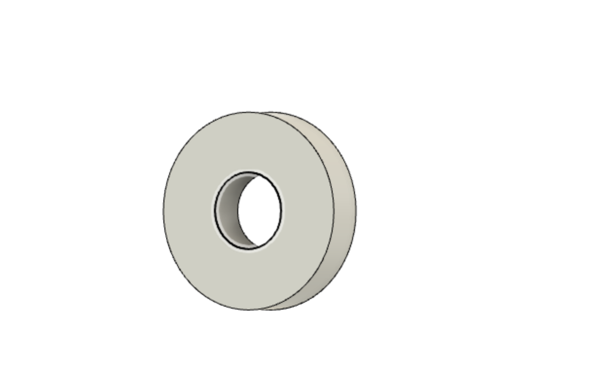
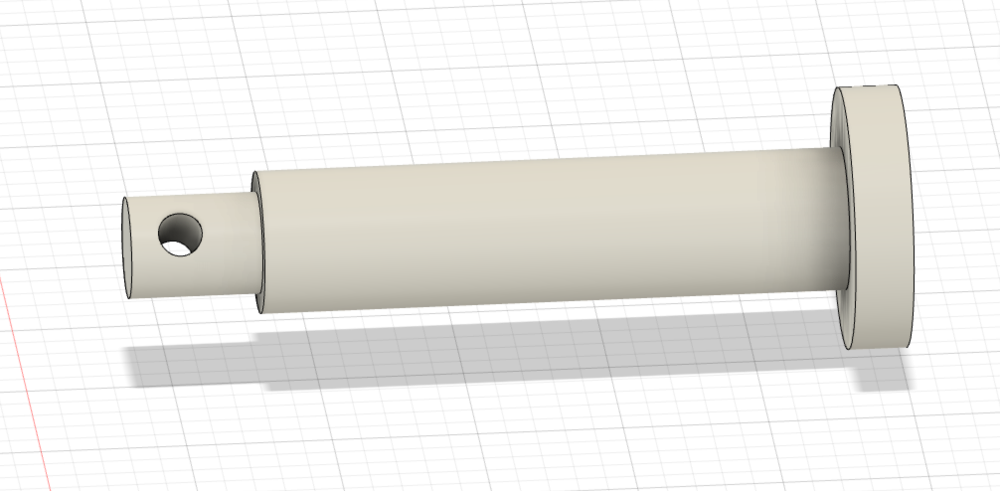
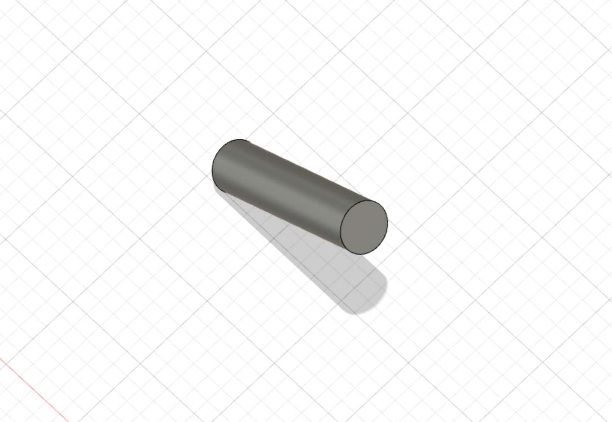
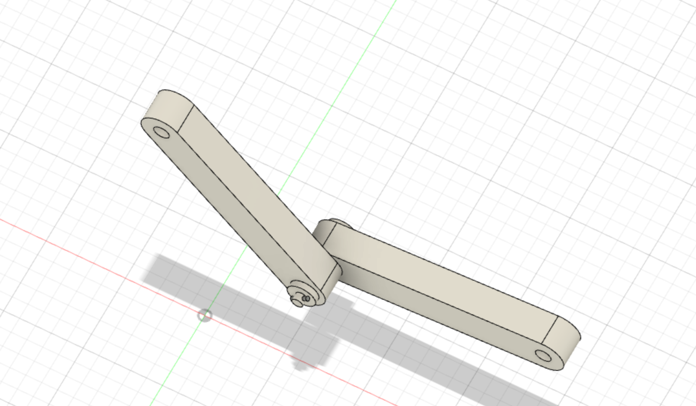
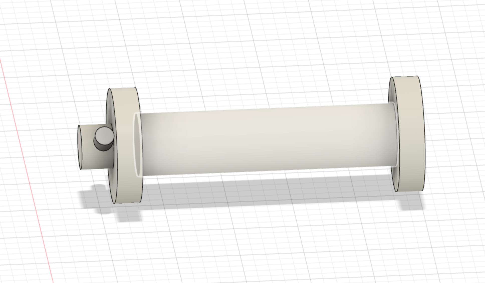
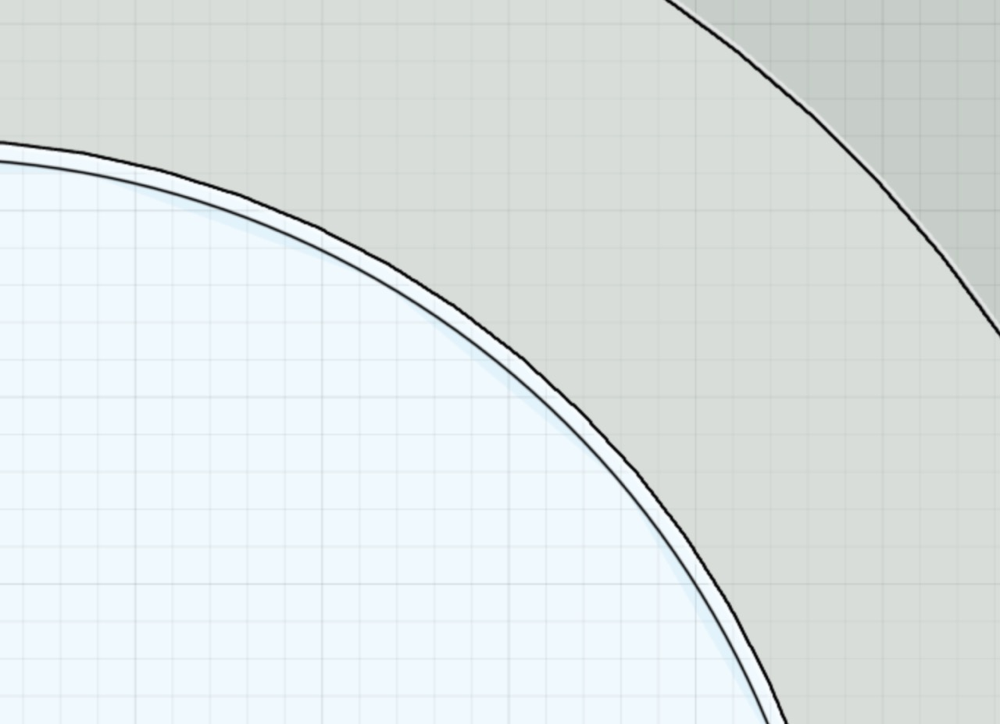
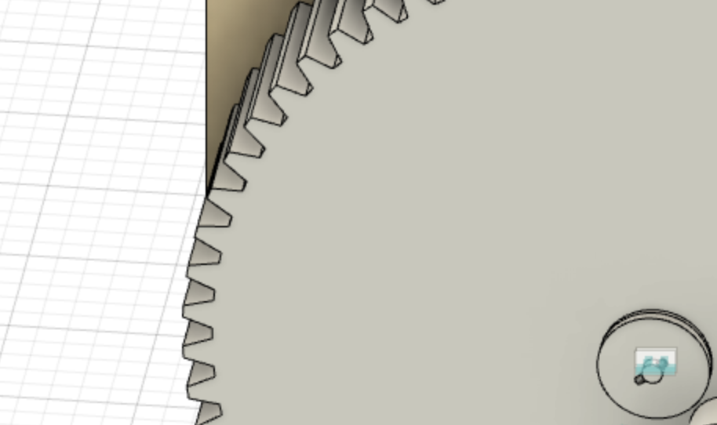
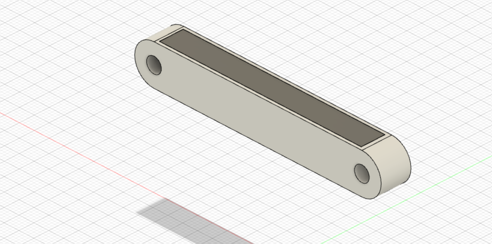
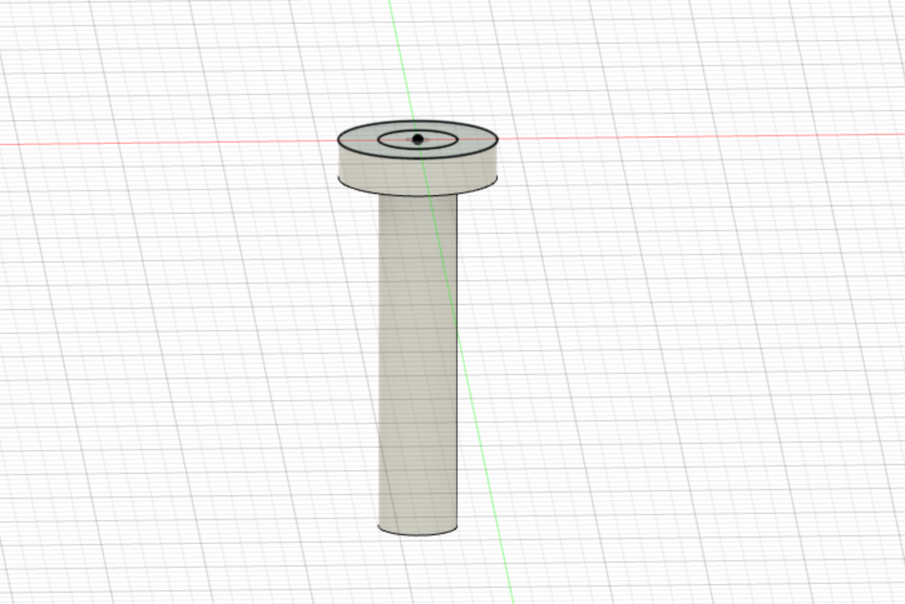
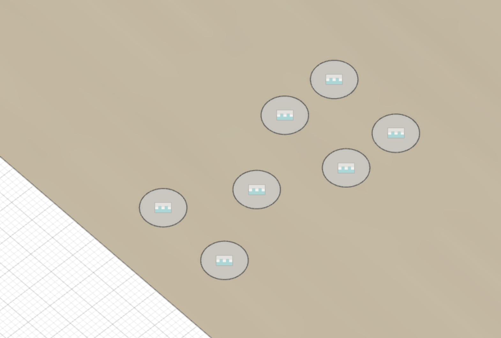

#  Manufacturing the mechanism
>Here is our report on the work undertaken

The main goal was to build detailed CAD model

## Introduction 
There are tasks, that we had to implement
1. Сделать CAD модель максимально подробную, как будто вы ее собрали (добавить винти, гайки, подшипники и все все все)
2. Заснять видео (motion study к примеру), как ваша деталь двигается
3. Сделать видео сборки вашей конструкции
4. Расшарить со мной папку со всеми материалами (share the project)
5. Залить в этот проект pdf с доп пояснениями, если требуются

Here you can find further explanations of connections between mechanism parts

### Motion study - https://youtu.be/kTbule8VVtY 
### Assemply - https://youtu.be/-2KDfPygNq8  

## How connections are build?
We had to makeconnections, that hold the connection firmly, but parts should rotate freely. 
Links rotate around pin, the other free end of the pin is blocked by шайба (we don't know hoe to translate it). We fasten with glue, also gap betweel pin and шайба is small (0.05mm), which also strengthens the connection

We decieded to use 1.5mm steel forelock that will hold the connection tight

The overall idea, that in created for each connection. Of course, some modifications for different connections appear

  
It is also worth to mention that we took into account gaps between elements. To allow rotations, 0.1 gap is made 

## Gear connection:
We connected gears the same eay, but also add 1mm silicon interlayer between gear and шайба to reduce wear. We also increased their size to strengthen the bracing

## Link modification:
We added steel sheets to top and down parts of mechanism. Now thwey can blow heavy loads. Create a hole 0.05 bigger in width, height and width that steel sheet which we are going to use. Use glue to connect parts

## Connections between not moving parts:
We need to connect wall and floor. Drill a hole in the wood (10mm, inluding 2mm of bigger size for hat of pin). Also don't forget to add 10mm hole in parts, that we want to connect to floor
\\

